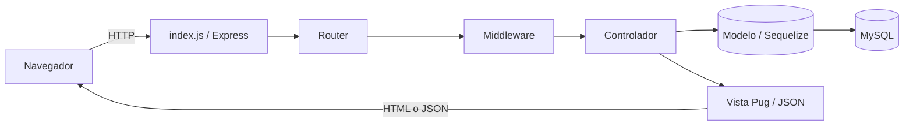
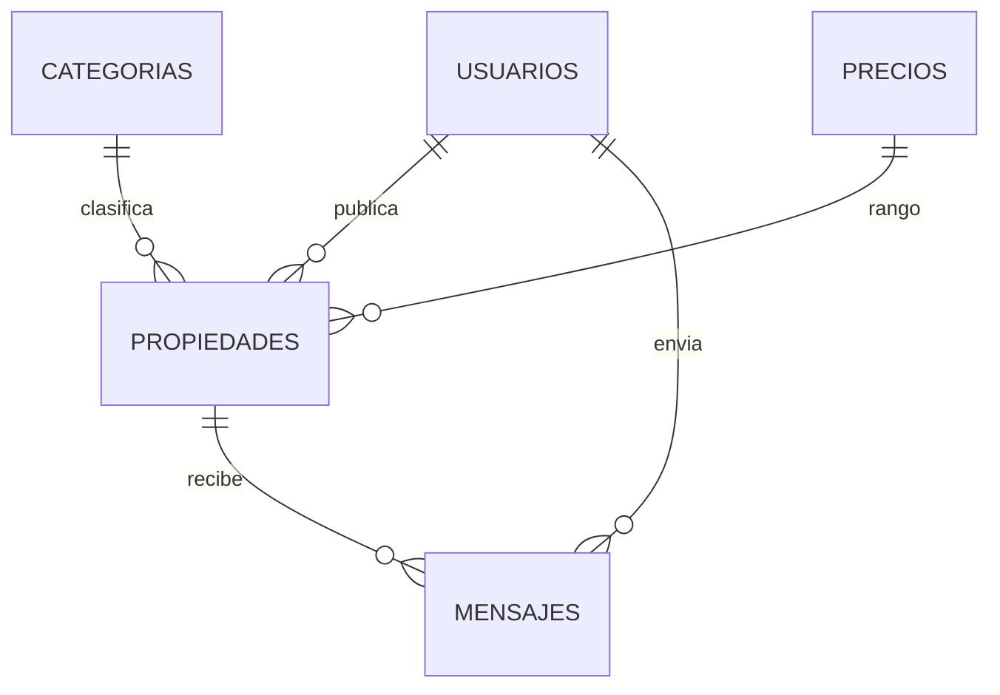

# 🏡 Bienes Raíces SENA — bienesraices-3002085

Portal web de **bienes raíces** desarrollado con Node.js siguiendo el patrón **MVC**. Permite a los usuarios registrarse, publicar propiedades (con imágenes y ubicación en mapa), buscarlas y filtrarlas, verlas en un mapa interactivo y contactar al vendedor mediante mensajes.

> Proyecto formativo — **Ficha 3002085**.

## Stack tecnológico

| Capa | Tecnología |
|------|-----------|
| Runtime | Node.js (ES Modules, `"type": "module"`) |
| Servidor | Express 5 |
| Vistas | Pug |
| Estilos | Tailwind CSS v4 (CSS-first, sin `tailwind.config.js`) |
| Bundling JS cliente | Webpack 5 |
| Base de datos | MySQL (driver `mysql2`) |
| ORM | Sequelize 6 |
| Autenticación | JSON Web Token (JWT) + bcrypt + cookies |
| Correos | Nodemailer |
| Subida de imágenes | Multer (servidor) + Dropzone (cliente) |
| Mapas | Leaflet (vía CDN) + Esri Geocoder |
| Seguridad | csurf (protección CSRF) |

---

## Índice

1. [Requisitos previos](#1-requisitos-previos)
2. [Instalación y puesta en marcha](#2-instalación-y-puesta-en-marcha)
3. [Arquitectura y estructura de carpetas](#3-arquitectura-y-estructura-de-carpetas)
4. [Flujo de arranque (`index.js`)](#4-flujo-de-arranque-indexjs)
5. [Modelo de datos](#5-modelo-de-datos)
6. [Rutas / endpoints](#6-rutas--endpoints)
7. [Flujos principales](#7-flujos-principales)
8. [Vistas (Pug)](#8-vistas-pug)
9. [Frontend / assets (Webpack + Tailwind + Leaflet)](#9-frontend--assets-webpack--tailwind--leaflet)
10. [Helpers](#10-helpers)
11. [Seeders (datos de prueba)](#11-seeders-datos-de-prueba)
12. [Problemas conocidos / deuda técnica](#12-problemas-conocidos--deuda-técnica)

---

## 1. Requisitos previos

- **Node.js** 18 o superior (el proyecto usa ES Modules y *top-level await*).
- **MySQL** en ejecución (local o remoto).
- **npm** (incluido con Node.js).
- Opcional: una cuenta SMTP para el envío de correos (p. ej. [Mailtrap](https://mailtrap.io) en desarrollo).

---

## 2. Instalación y puesta en marcha

### 2.1. Clonar e instalar dependencias

```bash
git clone https://github.com/jsebastiandq/bienesraices-3002085.git
cd bienesraices-3002085
npm i
```

### 2.2. Configurar variables de entorno

Crea un archivo `.env` en la raíz (puedes partir de `.env.example`) con las siguientes variables:

| Variable | Descripción |
|----------|-------------|
| `DB_NAME` | Nombre de la base de datos MySQL |
| `DB_USER` | Usuario de MySQL |
| `DB_PASS` | Contraseña de MySQL (si está vacía, usa `""`) |
| `DB_HOST` | Host de la base de datos (p. ej. `localhost` o `127.0.0.1`) |
| `DB_PORT` | Puerto de MySQL (por defecto `3306`) |
| `EMAIL_HOST` | Host del servidor SMTP |
| `EMAIL_PORT` | Puerto SMTP |
| `EMAIL_USER` | Usuario SMTP |
| `EMAIL_PASS` | Contraseña SMTP |
| `PORT` | Puerto en el que corre la app (por defecto `3000`) |
| `JWT_SECRET` | Cadena secreta para firmar los JWT |
| `BACKEND_URL` | ⚠️ URL base del backend (p. ej. `http://localhost`). **La usa `helpers/emails.js` para construir los enlaces de confirmación/reset, pero NO aparece en `.env.example` — recuerda añadirla.** |

> 💡 Debes crear previamente la base de datos vacía en MySQL con el nombre que pongas en `DB_NAME`. Las tablas se crean solas (Sequelize `sync`) al arrancar o al importar los seeders.

### 2.3. Poblar la base de datos (opcional pero recomendado)

```bash
npm run db:importar   # Crea las tablas e inserta categorías, precios y usuarios de prueba
npm run db:eliminar   # Vacía y recrea todas las tablas (sync force)
```

### 2.4. Levantar el proyecto en desarrollo

Necesitas **dos procesos** en paralelo (dos terminales):

```bash
npm run dev      # 1) Servidor Node con recarga automática (nodemon)
npm run styles   # 2) Compila Tailwind (CSS) y bundlea el JS del cliente (Webpack), ambos en watch
```

Luego abre **http://localhost:3000** (o el puerto que definas en `PORT`).

### 2.5. Scripts disponibles (`package.json`)

| Script | Comando | Qué hace |
|--------|---------|----------|
| `start` | `node index.js` | Arranca el servidor (producción) |
| `dev` | `nodemon index.js` | Arranca el servidor con recarga automática |
| `styles` | `concurrently "npm run css" "npm run js"` | Ejecuta `css` + `js` a la vez |
| `css` | `npx @tailwindcss/cli -i ./public/css/input.css -o ./public/css/style.css --watch` | Compila Tailwind en watch |
| `js` | `webpack --watch` | Bundlea `src/js/*` → `public/js/*` en watch |
| `db:importar` | `node ./seed/seeder.js -i` | Importa los datos semilla |
| `db:eliminar` | `node ./seed/seeder.js -e` | Elimina/recrea las tablas |

---

## 3. Arquitectura y estructura de carpetas

El proyecto sigue el patrón **MVC (Modelo–Vista–Controlador)**:

- **Modelos** (`models/`): definen las tablas y relaciones con Sequelize.
- **Vistas** (`views/`): plantillas Pug que generan el HTML.
- **Controladores** (`controllers/`): la lógica de negocio; reciben la petición, consultan modelos y renderizan vistas o devuelven JSON.
- **Rutas** (`routes/`): mapean URLs + método HTTP a un controlador, aplicando *middleware*.
- **Middleware** (`middleware/`): funciones que se ejecutan antes del controlador (autenticación, subida de archivos…).

```text
bienesraices-3002085/
├── index.js              # Punto de entrada: crea la app Express y monta todo
├── config/
│   └── db.js             # Configuración de la conexión Sequelize/MySQL
├── routes/               # Definición de endpoints
│   ├── appRoutes.js      #   Páginas públicas (/, categorías, 404, buscador)
│   ├── usuariosRoutes.js #   Autenticación (montado en /auth)
│   ├── propiedadesRoutes.js # CRUD de propiedades y mensajes
│   └── apiRoutes.js      #   API JSON (montado en /api)
├── controllers/          # Lógica de cada grupo de rutas
│   ├── appController.js
│   ├── usuariosController.js
│   ├── propiedadController.js
│   └── apiController.js
├── models/               # Modelos Sequelize
│   ├── index.js          #   Registra las asociaciones entre modelos
│   ├── Propiedades.js
│   ├── Usuarios.js
│   ├── Categorias.js
│   ├── Precios.js
│   └── Mensaje.js
├── middleware/
│   ├── protegerRuta.js       # Exige sesión válida (rutas privadas)
│   ├── identificarUsuario.js # Detecta sesión opcional (rutas públicas)
│   └── subirImagen.js        # Configuración de Multer
├── helpers/
│   ├── tokens.js         # generarJWT, generarId
│   ├── emails.js         # emailRegistro, emailOlvidePassword
│   └── index.js          # esVendedor, formatearFecha
├── views/                # Plantillas Pug (ver sección 8)
├── src/js/               # Fuentes JS del cliente (entradas de Webpack)
├── public/               # Assets servidos estáticamente
│   ├── css/              #   input.css (fuente) + style.css (generado)
│   ├── js/               #   bundles generados por Webpack
│   └── uploads/          #   imágenes subidas de las propiedades
├── seed/                 # Scripts y datos para poblar la BD
├── webpack.config.js     # Configuración de Webpack (5 entradas)
├── package.json
└── .env.example
```

### Flujo de una petición



---

## 4. Flujo de arranque (`index.js`)

Al ejecutar `npm run dev` / `npm start`, `index.js` hace lo siguiente **en orden**:

1. Crea la app Express.
2. Registra los **middlewares globales**:
   - `express.urlencoded({ extended: true })` — lectura de formularios.
   - `cookieParser()` — parseo de cookies.
   - `csurf({ cookie: true })` — protección CSRF basada en cookie (el token se expone a las vistas con `req.csrfToken()`).
3. **Conecta a la base de datos**: `await db.authenticate()` y `db.sync()` (crea/actualiza las tablas).
4. Configura **Pug** como motor de vistas (`views/`).
5. Sirve la carpeta **`public/`** como estáticos (CSS, JS e imágenes de `uploads`).
6. **Monta los routers**:
   | Prefijo | Router |
   |---------|--------|
   | `/` | `appRoutes` |
   | `/auth` | `usuariosRoutes` |
   | `/` | `propiedadesRoutes` |
   | `/api` | `apiRoutes` |
7. Escucha en `process.env.PORT || 3000`.

---

## 5. Modelo de datos

Todos los modelos heredan `timestamps: true` (columnas `createdAt` / `updatedAt`) desde la configuración global de `config/db.js`.

### Propiedades (`propiedades`)

| Campo | Tipo | Notas |
|-------|------|-------|
| `id` | UUID | Clave primaria (UUIDv4) |
| `titulo` | STRING(100) | Obligatorio |
| `descripcion` | TEXT | Obligatorio |
| `habitaciones` | INTEGER | Obligatorio |
| `parqueaderos` | INTEGER | Obligatorio |
| `wc` | INTEGER | Nº de baños |
| `calle` | STRING(70) | Dirección |
| `lat` | STRING | Latitud (mapa) |
| `lng` | STRING | Longitud (mapa) |
| `imagen` | STRING | Nombre del archivo en `public/uploads/` |
| `publicado` | BOOLEAN | `false` por defecto |

### Usuarios (`usuarios`)

| Campo | Tipo | Notas |
|-------|------|-------|
| `nombre` | STRING | Obligatorio |
| `email` | STRING | Obligatorio |
| `password` | STRING | Obligatorio, se hashea con bcrypt |
| `token` | STRING | Token de confirmación / reset |
| `confirmado` | BOOLEAN | Cuenta verificada por email |

- **Hook `beforeCreate`**: hashea la contraseña con bcrypt (salt 10) antes de guardar.
- **Scope `eliminarPassword`**: excluye campos sensibles al consultar (usado en middlewares e includes).
- **Método `verificarPassword(password)`**: compara con `bcrypt.compareSync`.

### Categorias (`categorias`)

| Campo | Tipo |
|-------|------|
| `nombre` | STRING(30) |

### Precios (`precios`)

| Campo | Tipo |
|-------|------|
| `nombre` | STRING(60) |

### Mensaje (`mensajes`)

| Campo | Tipo |
|-------|------|
| `mensaje` | STRING(200) |

### Relaciones (`models/index.js`)



- `Propiedades` pertenece a `Precios`, `Categorias` y `Usuarios`.
- `Mensaje` pertenece a `Propiedades` (`propiedadId`) y `Usuarios` (`usuarioId`).

> ⚠️ Ver [Problemas conocidos](#12-problemas-conocidos--deuda-técnica): las asociaciones no declaran alias `as` ni las relaciones inversas `hasMany`.

---

## 6. Rutas / endpoints

### `appRoutes` — páginas públicas (prefijo `/`)

| Método | Ruta | Controlador | Descripción |
|--------|------|-------------|-------------|
| GET | `/` | `inicio` | Home: filtros, mapa y últimas propiedades |
| GET | `/categorias/:id` | `categoria` | Lista propiedades de una categoría |
| GET | `/404` | `noEncontrado` | Página de error |
| POST | `/buscador` | `buscador` | Búsqueda por título (`LIKE`) |

### `usuariosRoutes` — autenticación (prefijo `/auth`)

| Método | Ruta | Controlador | Descripción |
|--------|------|-------------|-------------|
| GET | `/auth/login` | `formularioLogin` | Formulario de login |
| POST | `/auth/login` | `autenticar` | Valida credenciales y crea la cookie de sesión |
| GET | `/auth/registro` | `formularioRegistro` | Formulario de registro |
| POST | `/auth/registro` | `registrar` | Crea el usuario y envía email de confirmación |
| GET | `/auth/confirmar/:token` | `confirmar` | Confirma la cuenta con el token del email |
| GET | `/auth/olvide-password` | `formularioOlvidePassword` | Formulario de recuperación |
| POST | `/auth/olvide-password` | `resetPassword` | Envía email con enlace de reset |
| GET | `/auth/olvide-password/:token` | `comprobarToken` | Valida el token y muestra el formulario |
| POST | `/auth/olvide-password/:token` | `nuevoPassword` | Guarda la nueva contraseña |

### `propiedadesRoutes` — propiedades y mensajes (prefijo `/`)

Middlewares: **`protegerRuta`** (privada), **`identificarUsuario`** (opcional), **`upload`** (Multer), **`body(...)`** (validaciones de `express-validator`).

| Método | Ruta | Middleware | Controlador | Descripción |
|--------|------|-----------|-------------|-------------|
| GET | `/mis-propiedades` | protegerRuta | `admin` | Panel del usuario (con paginación) |
| GET | `/propiedades/crear` | protegerRuta | `crear` | Formulario de alta |
| POST | `/propiedades/crear` | validaciones + protegerRuta | `guardar` | Crea la propiedad |
| GET | `/propiedades/agregar-imagen/:id` | protegerRuta | `agregarImagen` | Formulario de imagen |
| POST | `/propiedades/agregar-imagen/:id` | protegerRuta + upload | `almacenarImagen` | Sube la imagen y publica |
| GET | `/propiedades/editar/:id` | protegerRuta | `editar` | Formulario de edición |
| POST | `/propiedades/editar/:id` | protegerRuta + validaciones | `guardarCambios` | Actualiza la propiedad |
| POST | `/propiedades/eliminar/:id` | protegerRuta | `eliminar` | Borra propiedad e imagen |
| PUT | `/propiedades/:id` | protegerRuta | `cambiarEstado` | Publica/despublica (JSON) |
| GET | `/propiedad/:id` | identificarUsuario | `mostrarPropiedad` | Ficha pública |
| POST | `/propiedad/:id` | identificarUsuario + validación | `enviarMensaje` | Envía mensaje al vendedor |
| GET | `/mensajes/:id` | protegerRuta | `verMensajes` | Bandeja de mensajes de una propiedad |

### `apiRoutes` — API JSON (prefijo `/api`)

| Método | Ruta | Controlador | Descripción |
|--------|------|-------------|-------------|
| GET | `/api/propiedades` | `propiedades` | Devuelve todas las propiedades en JSON (para el mapa del home) |

---

## 7. Flujos principales

### 7.1. Autenticación

1. **Registro** (`POST /auth/registro`): valida nombre, email, password (≥ 6) y confirmación; comprueba que el email no exista; crea el usuario con un `token` y envía un email de confirmación (`emailRegistro`).
2. **Confirmar cuenta** (`GET /auth/confirmar/:token`): busca por token, marca `confirmado = true` y limpia el token.
3. **Login** (`POST /auth/login`): valida credenciales, exige cuenta confirmada, verifica la contraseña (`verificarPassword`), genera un **JWT** (`generarJWT`) y lo guarda en la cookie **`_token`** (httpOnly). Redirige a `/mis-propiedades`.
4. **Recuperar contraseña**: `resetPassword` envía un email con token (`emailOlvidePassword`); `comprobarToken` valida el enlace; `nuevoPassword` guarda la nueva contraseña (hasheada con bcrypt).

### 7.2. Publicar una propiedad

1. **Crear** (`/propiedades/crear`): formulario con datos + **mapa Leaflet** para fijar `calle`, `lat`, `lng`.
2. **Guardar** (`guardar`): valida y crea la propiedad con `imagen: ""` y `publicado: false`, asignando el `usuarioId` del token. Redirige a agregar imagen.
3. **Agregar imagen** (`/propiedades/agregar-imagen/:id`): sube el archivo con **Dropzone → Multer**; `almacenarImagen` guarda el nombre del archivo y marca `publicado = 1`.
4. **Editar / Eliminar / Cambiar estado**: `editar` + `guardarCambios` actualizan; `eliminar` borra el registro **y el archivo de imagen del disco** (`unlink` en `public/uploads/`); `cambiarEstado` alterna `publicado` y responde JSON (usado por el botón del panel vía `PUT`).

> 🔒 Todas estas rutas verifican además que la propiedad **pertenezca al usuario autenticado** antes de operar.

### 7.3. Búsqueda y visualización

- **Home** (`inicio`): muestra filtros de categoría/precio, un **mapa interactivo** que consume `GET /api/propiedades`, y las propiedades más recientes de casas y departamentos (renderizadas con `templates/card.pug`).
- **Buscador** (`buscador`): búsqueda `LIKE %término%` sobre el título.
- **Categoría** (`categoria`): lista las propiedades de una categoría; si no existe, redirige a `/404`.
- **Ficha** (`mostrarPropiedad`): detalle público; si hay sesión (y no es el propio vendedor) muestra el formulario de contacto. `enviarMensaje` crea el mensaje; `verMensajes` (solo el propietario) lista la bandeja con fecha formateada (`formatearFecha`).

### 7.4. Protección de rutas y CSRF

- **`protegerRuta`**: exige la cookie `_token`; verifica el JWT con `JWT_SECRET`, carga el usuario (sin password) en `req.usuario` y, si falla, limpia la cookie y redirige a `/auth/login`.
- **`identificarUsuario`**: identificación *opcional*; si no hay token, `req.usuario = null` y continúa (para vistas públicas que cambian según haya sesión).
- **CSRF**: cada formulario incluye un campo oculto `input[name="_csrf"]`; las peticiones `fetch` (cambiar estado, subir imagen) envían el token en la cabecera `CSRF-Token` (leído de `<meta name="csrf-token">`).

---

## 8. Vistas (Pug)

Jerarquía: **layouts** (esqueleto con `block`s) → **páginas** (`extends` + bloques) → **templates/includes** (fragmentos con `include`).

### Layouts — `views/layout/`

| Archivo | Uso |
|---------|-----|
| `index.pug` | Layout sin header (autenticación y mensajes) |
| `app.pug` | Layout público con `header-app` (navegación + buscador) |
| `admin.pug` | Layout de administración con `header-admin` |

### Includes y templates

| Archivo | Uso |
|---------|-----|
| `layout/includes/header-app.pug` | Header público: logo, login/registro, categorías, buscador |
| `layout/includes/header-admin.pug` | Header del panel (Mis Propiedades, Perfil, Cerrar Sesión) |
| `templates/card.pug` | Tarjeta de propiedad reutilizable (usada en bucles `each`) |
| `templates/mensaje.pug` | Página genérica de mensaje/confirmación |

### Páginas

| Archivo | Descripción |
|---------|-------------|
| `inicio.pug` | Home con filtros, mapa y secciones de casas/departamentos |
| `busqueda.pug` | Resultados del buscador |
| `categoria.pug` | Listado por categoría |
| `404.pug` | Página de no encontrado |
| `auth/login.pug` | Login |
| `auth/registro.pug` | Registro |
| `auth/confirmar-cuenta.pug` | Feedback de confirmación |
| `auth/olvide-password.pug` | Solicitud de reset |
| `auth/reset-password.pug` | Nueva contraseña |
| `propiedades/admin.pug` | Panel "Mis Propiedades" (paginación, publicar/editar/eliminar) |
| `propiedades/crear.pug` | Alta con mapa |
| `propiedades/editar.pug` | Edición con mapa |
| `propiedades/agregar-imagen.pug` | Subida con Dropzone |
| `propiedades/mostrar.pug` | Ficha pública + contacto |

---

## 9. Frontend / assets (Webpack + Tailwind + Leaflet)

### JS del cliente (Webpack)

`webpack.config.js` define **5 entradas** en `src/js/` que se bundlean a `public/js/` con el mismo nombre:

| Fuente (`src/js/`) | Bundle (`public/js/`) | Función |
|--------------------|----------------------|---------|
| `mapa.js` | `mapa.js` | Mapa editable en crear/editar (marcador arrastrable + geocoding, rellena `calle`/`lat`/`lng`) |
| `mostrarMapa.js` | `mostrarMapa.js` | Mapa de solo lectura en la ficha |
| `mapaInicio.js` | `mapaInicio.js` | Mapa del home: `fetch('/api/propiedades')` + filtros en cliente |
| `cambiarEstado.js` | `cambiarEstado.js` | Botón publicar/despublicar (`fetch PUT` con `CSRF-Token`) |
| `agregarImagen.js` | `agregarImagen.js` | Configura Dropzone (png/jpg, máx 1 archivo/5MB) |

### Estilos (Tailwind CSS v4)

- Fuente: `public/css/input.css` → una línea `@import "tailwindcss";`.
- Salida: `public/css/style.css` (compilado por la CLI de Tailwind, es el que consumen las vistas).
- **No hay `tailwind.config.js` ni `postcss.config.js`**: Tailwind v4 usa configuración *CSS-first*.

### Mapas

Leaflet (y Esri Geocoder / GeoSearch) se cargan por **CDN** en las vistas; solo la lógica propia va en los bundles de Webpack.

> ⚠️ **Archivos generados — no editar a mano**: `public/css/style.css` y todos los `public/js/*.js`. Se regeneran desde `public/css/input.css` y `src/js/` con `npm run styles`.

---

## 10. Helpers

| Archivo | Exporta | Descripción |
|---------|---------|-------------|
| `helpers/tokens.js` | `generarJWT`, `generarId` | `generarJWT({id, nombre})` firma un JWT (expira en 1 día); `generarId()` genera ids aleatorios para tokens y nombres de archivo |
| `helpers/emails.js` | `emailRegistro`, `emailOlvidePassword` | Envío de correos con Nodemailer (SMTP por env); construyen enlaces con `BACKEND_URL:PORT` |
| `helpers/index.js` | `esVendedor`, `formatearFecha` | `esVendedor(usuarioId, propiedadUsuarioId)` compara propiedad; `formatearFecha(fecha)` formatea a español (`es-ES`) |

---

## 11. Seeders (datos de prueba)

`seed/seeder.js` puebla o vacía la base de datos según el flag recibido:

- **`-i` (importar)**: autentica, sincroniza tablas y hace `bulkCreate` de categorías, precios y usuarios.
- **`-e` (eliminar)**: `db.sync({ force: true })` — dropea y recrea todas las tablas.

| Archivo | Contenido |
|---------|-----------|
| `seed/categoria.js` | 6 categorías: Casa, Apartamentos, Edificios, Finca, Bodega, Cabaña |
| `seed/precio.js` | 5 rangos de precio en COP |
| `seed/usuario.js` | 2 usuarios de prueba (ya confirmados), contraseña `123456` hasheada con bcrypt. Emails: `info@jsebastiandq.com` e `info@test.com` |

Se ejecutan con `npm run db:importar` / `npm run db:eliminar`.

---

## 12. Problemas conocidos / deuda técnica

Esta sección documenta inconsistencias detectadas en el código actual. **No son parte del diseño previsto**; conviene revisarlas.

1. **Asociaciones incompletas en `models/index.js`**: las relaciones no declaran alias `as` ni la relación inversa `hasMany`, y las opciones de clave foránea están mal escritas (`ForeignKey` en vez de `foreignKey`, `UsuarioId`). Sin embargo, varios controladores hacen `include` usando alias (`precio`, `categoria`, `usuario`, `mensajes`), lo que puede provocar **errores en tiempo de ejecución**.

2. **Campo `estacionamiento` vs `parqueaderos`**: en `guardarCambios` (edición de propiedad) se desestructura `estacionamiento` del body, pero el modelo y el formulario usan `parqueaderos`. Ese campo **no se actualiza** al editar.

3. **Scope `eliminarPassword` con nombres incorrectos**: excluye `createAt` / `updateAt`, cuando Sequelize genera `createdAt` / `updatedAt`. Esos timestamps no se excluyen realmente.

4. **`BACKEND_URL` ausente en `.env.example`**: la usan los correos (`helpers/emails.js`) para construir los enlaces. Si falta, los enlaces de confirmación/reset quedarán mal formados.

5. **`console.log` de depuración**: `middleware/protegerRuta.js` imprime el usuario en consola; conviene retirarlo.

6. **Cookie de sesión sin flags de seguridad**: al crear la cookie `_token` en `autenticar`, las opciones `secure` / `sameSite` están comentadas. Deben habilitarse en producción (HTTPS).

7. **Enlaces placeholder**: en `header-admin.pug` varios `href="#"` (Mi Perfil, Cerrar Sesión) aún no están cableados.

8. **Artefactos generados versionados**: el `.gitignore` solo excluye `node_modules` y `.env`, por lo que `public/css/style.css`, `public/js/*.js`, `public/uploads/*` y archivos `.DS_Store` quedan bajo control de versiones. Considera ignorar los generados.

---

*Documentación generada para el proyecto formativo de la Ficha 3002085.*
